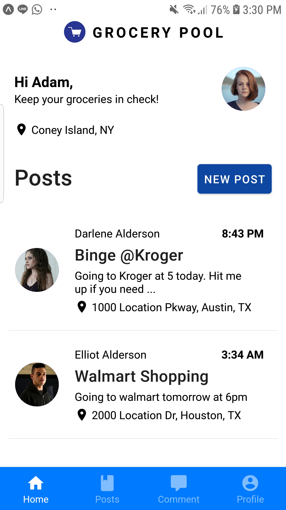

<p align="center"> 
  
</p>
 
<h1 align="center">Grocery Pool</h1> 

<p align="center">
A mobile application that helps limit social interaction outside by allowing individuals to request shoppers to pick up items for them.
</p>

## Screenshots



## Features 

* Users register with email and password as well as their address
* Registered users make posts about what store they're heading to
* Other users can make requests to the shopper to pick up certain items
* Requests can be accepted or rejected
* Google Maps to determine where others are

## Built With

* [Node.js](https://nodejs.org/)
* [Express](https://expressjs.com/)
* [MongoDB](https://www.mongodb.com/)
* [Mongoose](http://mongoosejs.com/)
* [Async](http://caolan.github.io/async/)
* [Crypto](https://nodejs.org/api/crypto.html#crypto_crypto)
* [Helmet](https://helmetjs.github.io/)
* [Passport](http://www.passportjs.org/)
* [Passport-local](https://github.com/jaredhanson/passport-local#passport-local)
* [Express-session](https://github.com/expressjs/session#express-session)
* [Method-override](https://github.com/expressjs/method-override#method-override)
* [Nodemailer](https://nodemailer.com/about/)
* [Moment](https://momentjs.com/)
* [Cloudinary](https://cloudinary.com/)
* [Geocoder](https://github.com/wyattdanger/geocoder#geocoder)
* [Connect-flash](https://github.com/jaredhanson/connect-flash#connect-flash)
* [RESTful API](https://restfulapi.net/)
* [React Native](https://reactnative.dev/)

## Clone

```
git clone https://github.com/aahmad4/Grocery-Pool
```

## Installation

Use the package manager [npm](https://www.npmjs.com/) to install the required packages.

```bash
npm install 
```

## Usage

Start back-end server
```
node app.js
```
Start react-native front-end: Use android emulator on computer or [expo](https://expo.io/) on phone.


## Contributing

Pull requests are welcome. For major changes, please open an issue first to discuss what you would like to change.

Please make sure to update tests as appropriate.
